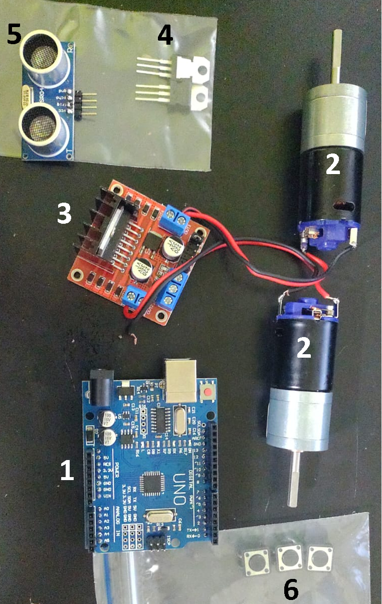
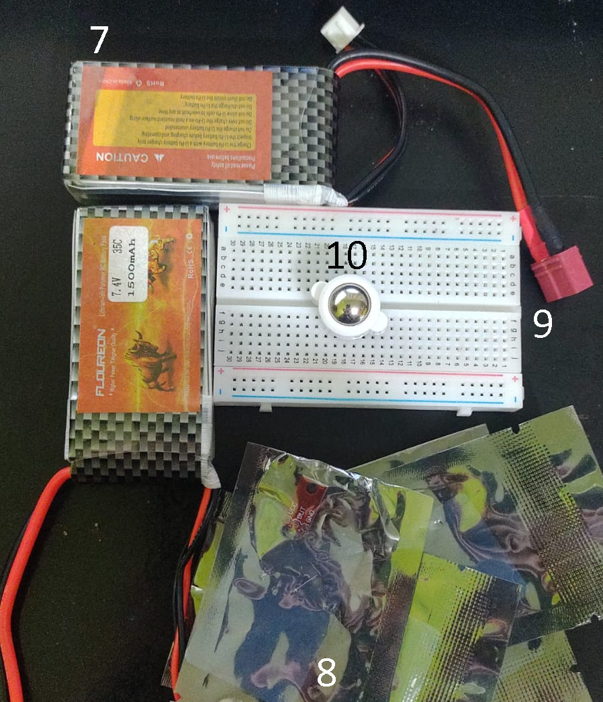

# SumoBot: body

In this folder you will find everything you need to assemble the physical part of the robot discounting the circuit.
This includes (with images):
1. List of commercial components.
2. Links original files for 3D printing in GrabCAD.
3. Printing instructions
4. Assembly instructions.
6. Recommendations and observations

## Commercial components
- 1 x UNO R3 (UNO Full Microcontrolador Compatible, based on an ATmega microcontroller) (1)
- 2 x Motor Reductor 192rpm marca Troy modelo Luxor 25GA 12V (2)
- 1 x Driver L298N Puente H (3)
- 1 x Linear Regulator L7805CV  (4)
- 3 x Sensor Ultrasonico HC-SR04 (5)
- 3 x Push Button Momentary Switch 12mm (6)
- Floureon LiPo Battery 7,4 V 1500 mAh (7)
- 4 x analog Infrared reflective sensor 1-a (8)
- 1 x Protoboard  (9)
- mini 3PI car N20 Caster (10)
- Cabos  

